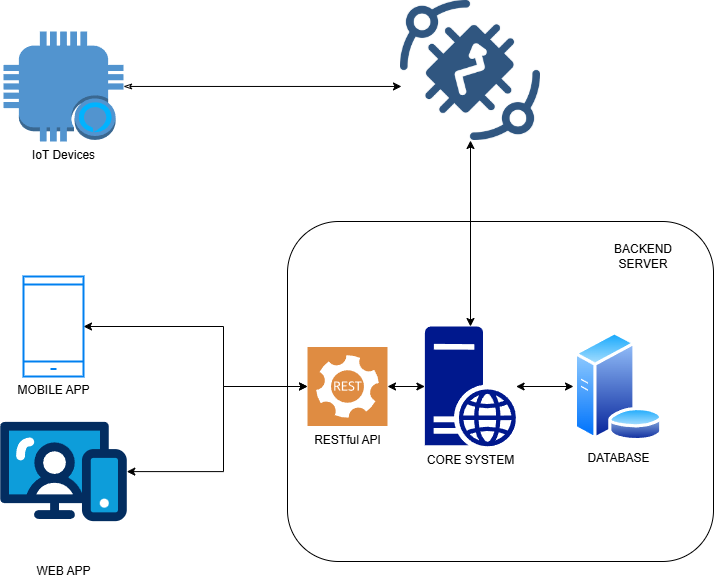
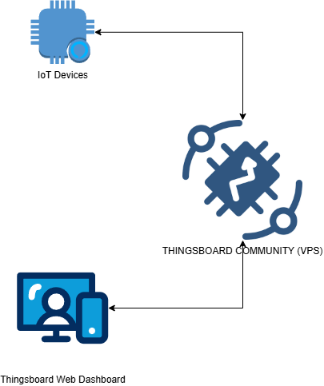
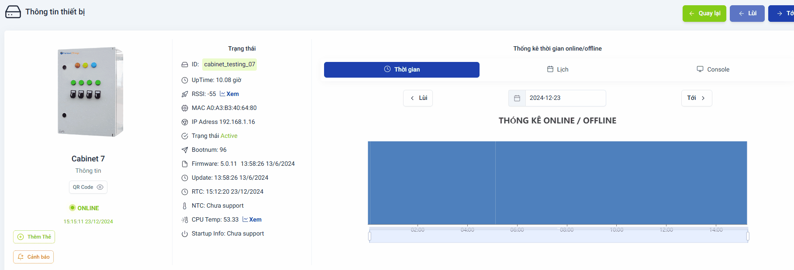

**Project 1** (project_1_1.gif, project_1_2.gif)

In this project, we established a self-hosted ThingsBoard instance (Community Edition) on a Virtual Private Server (VPS). ThingsBoard serves as the core platform for this IoT solution, which supports a variety of devices. We designed the system with multiple dashboards, adhering to the following architecture:

*   **MQTT Connection:** IoT devices connect to the ThingsBoard server via the MQTT protocol.
*   **Admin Dashboard:** Administrators have a dedicated dashboard interface for comprehensive device monitoring and management.
*   **End-User Dashboards:** End-users are provided with individual accounts and access to specific dashboards. The project's B2B business model means custom front-end development and mobile application builds were not required. This approach allows for efficient monitoring and interaction with IoT devices within the existing ThingsBoard framework.

![[project_1_2.gif]]

**Project 2** (project_2.gif)

For this project, we also deployed a self-hosted ThingsBoard server on a VPS. However, in this implementation, ThingsBoard primarily handles MQTT connection management. All core operations and data processing are managed by our proprietary Cloud Server. Specifically:

*   **MQTT Broker Role:** ThingsBoard acts as an MQTT broker, managing connections from IoT devices.
*   **Data Storage:** Device data is stored in a separate database, not within the ThingsBoard platform.
*   **API for Applications:** Our Cloud Server provides a dedicated API, allowing mobile and web applications to interact with connected devices. This centralized approach grants greater flexibility in terms of data handling and enables us to provide tailored application experiences.

